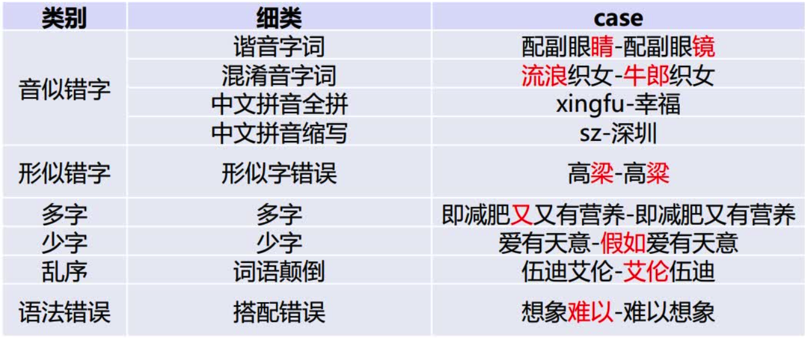
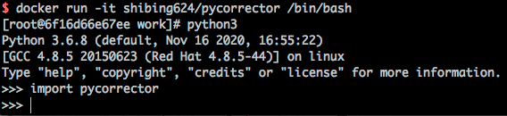

[**🇨🇳中文**](https://github.com/shibing624/pycorrector/blob/master/README.md) | [**🌐English**](https://github.com/shibing624/pycorrector/blob/master/README_EN.md) | [**📖文档/Docs**](https://github.com/shibing624/pycorrector/wiki) | [**🤖模型/Models**](https://huggingface.co/shibing624) 

<div align="center">
  <a href="https://github.com/shibing624/pycorrector">
    
  </a>
</div>

-----------------

# pycorrector: useful python text correction toolkit
[](https://badge.fury.io/py/pycorrector)
[](https://pepy.tech/project/pycorrector)
[](https://github.com/shibing624/pycorrector/graphs/contributors)
[](LICENSE)
[](requirements.txt)
[](https://github.com/shibing624/pycorrector/issues)
[](#wechat-group)


**pycorrector**: 中文文本纠错工具。支持中文音似、形似、语法错误纠正，python3开发。

**pycorrector**实现了Kenlm、ConvSeq2Seq、BERT、MacBERT、ELECTRA、ERNIE、Transformer等多种模型的文本纠错，并在SigHAN数据集评估各模型的效果。

**Guide**

- [Question](#Question)
- [Solution](#Solution)
- [Evaluation](#Evaluation)
- [Install](#install)
- [Usage](#usage)
- [Deep Model Usage](#deep-model-usage)
- [Dataset](#Dataset)
- [Contact](#Contact)
- [Reference](#reference)

# Question

中文文本纠错任务，常见错误类型：



当然，针对不同业务场景，这些问题并不一定全部存在，比如拼音输入法、语音识别校对关注音似错误；五笔输入法、OCR校对关注形似错误，
搜索引擎query纠错关注所有错误类型。

本项目重点解决其中的"音似、形字、语法、专名错误"等类型。

# Solution

### 规则的解决思路
依据语言模型检测错别字位置，通过拼音音似特征、笔画五笔编辑距离特征及语言模型困惑度特征纠正错别字。

1. 中文纠错分为两步走，第一步是错误检测，第二步是错误纠正；
2. 错误检测部分先通过结巴中文分词器切词，由于句子中含有错别字，所以切词结果往往会有切分错误的情况，这样从字粒度和词粒度两方面检测错误， 整合这两种粒度的疑似错误结果，形成疑似错误位置候选集；
3. 错误纠正部分，是遍历所有的疑似错误位置，并使用音似、形似词典替换错误位置的词，然后通过语言模型计算句子困惑度，对所有候选集结果比较并排序，得到最优纠正词。

### 深度模型的解决思路

1. 端到端的深度模型可以避免人工提取特征，减少人工工作量，RNN序列模型对文本任务拟合能力强，RNN Attn在英文文本纠错比赛中取得第一名成绩，证明应用效果不错；
2. CRF会计算全局最优输出节点的条件概率，对句子中特定错误类型的检测，会根据整句话判定该错误，阿里参赛2016中文语法纠错任务并取得第一名，证明应用效果不错；
3. Seq2Seq模型是使用Encoder-Decoder结构解决序列转换问题，目前在序列转换任务中（如机器翻译、对话生成、文本摘要、图像描述）使用最广泛、效果最好的模型之一；
4. BERT/ELECTRA/ERNIE/MacBERT等预训练模型强大的语言表征能力，对NLP届带来翻天覆地的改变，海量的训练数据拟合的语言模型效果无与伦比，基于其MASK掩码的特征，可以简单改造预训练模型用于纠错，加上fine-tune，效果轻松达到最优。

PS：

- [作者纠错分享](https://github.com/shibing624/pycorrector/wiki/pycorrector%E6%BA%90%E7%A0%81%E8%A7%A3%E8%AF%BB-%E7%9B%B4%E6%92%AD%E5%88%86%E4%BA%AB)
- [网友源码解读](https://zhuanlan.zhihu.com/p/138981644)


# Feature

* [Kenlm模型](pycorrector/corrector.py)：本项目基于Kenlm统计语言模型工具训练了中文NGram语言模型，结合规则方法、混淆集可以纠正中文拼写错误，方法速度快，扩展性强，效果一般
* [MacBERT模型](pycorrector/macbert)【推荐】：本项目基于PyTorch实现了用于中文文本纠错的MacBERT4CSC模型，模型加入了错误检测和纠正网络，适配中文拼写纠错任务，效果好
* [Seq2Seq模型](pycorrector/seq2seq)：本项目基于PyTorch实现了用于中文文本纠错的Seq2Seq模型、ConvSeq2Seq模型，其中ConvSeq2Seq在NLPCC-2018的中文语法纠错比赛中，使用单模型并取得第三名，可以并行训练，模型收敛快，效果一般
* [T5模型](pycorrector/t5)：本项目基于PyTorch实现了用于中文文本纠错的T5模型，使用Langboat/mengzi-t5-base的预训练模型fine-tune中文纠错数据集，模型改造的潜力较大，效果好
* [BERT模型](pycorrector/bert)：本项目基于PyTorch实现了基于原生BERT的fill-mask能力进行纠正错字的方法，效果差
* [ELECTRA模型](pycorrector/electra)：本项目基于PyTorch实现了基于原生ELECTRA的fill-mask能力进行纠正错字的方法，效果差
* [ERNIE_CSC模型](pycorrector/ernie_csc)：本项目基于PaddlePaddle实现了用于中文文本纠错的ERNIE_CSC模型，模型在ERNIE-1.0上fine-tune，模型结构适配了中文拼写纠错任务，效果好
* [DeepContext模型](pycorrector/deepcontext)：本项目基于PyTorch实现了用于文本纠错的DeepContext模型，该模型结构参考Stanford University的NLC模型，2014英文纠错比赛得第一名，效果一般
* [Transformer模型](pycorrector/transformer)：本项目基于PyTorch的fairseq库调研了Transformer模型用于中文文本纠错，效果一般

# Demo

Official Demo: https://www.mulanai.com/product/corrector/

HuggingFace Demo: https://huggingface.co/spaces/shibing624/pycorrector


run example: [examples/gradio_demo.py](examples/gradio_demo.py) to see the demo:
```shell
python examples/gradio_demo.py
```

# Evaluation

提供评估脚本[examples/evaluate_models.py](./examples/evaluate_models.py)：

- 使用sighan15评估集：SIGHAN2015的测试集[pycorrector/data/cn/sighan_2015/test.tsv](pycorrector/data/cn/sighan_2015/test.tsv)
  ，已经转为简体中文。
- 评估标准：纠错准召率，采用严格句子粒度（Sentence Level）计算方式，把模型纠正之后的与正确句子完成相同的视为正确，否则为错。

### 评估结果
评估数据集：SIGHAN2015测试集

GPU：Tesla V100，显存 32 GB

| Model Name      | Model Hub Link                                                                                                      | Backbone                 | GPU | Precision | Recall | F1 | QPS     |
|:----------------|:--------------------------------------------------------------------------------------------------------------------|:-------------------------|:----|:----------| :--| :--- |:--------|
| Kenlm           | -                                                                                                                   | kenlm                    | CPU | 0.6860    | 0.1529 | 0.2500 | 9       |
| BART-CSC        | [shibing624/bart4csc-base-chinese](https://huggingface.co/shibing624/bart4csc-base-chinese)                         | fnlp/bart-base-chinese   | GPU | 0.6984    | 0.6354 | 0.6654 | 58      |
| Mengzi-T5-CSC   | [shibing624/mengzi-t5-base-chinese-correction](https://huggingface.co/shibing624/mengzi-t5-base-chinese-correction) | mengzi-t5-base           | GPU | **0.8321**    | 0.6390 | 0.7229 | 214     |
| **MacBERT-CSC** | [shibing624/macbert4csc-base-chinese](https://huggingface.co/shibing624/macbert4csc-base-chinese)                   | hfl/chinese-macbert-base | GPU | 0.8254  | **0.7311** | **0.7754** | **224** |
| ChatGLM3-6B-CSC | [shibing624/chatglm3-6b-csc-chinese-lora](https://huggingface.co/shibing624/chatglm3-6b-csc-chinese-lora)           | chatglm3-6b              | GPU | 0.5263    | 0.4052 | 0.4579 | 4       |

### 结论

- 中文拼写纠错模型效果最好的是**MacBert-CSC**，模型名称是*shibing624/macbert4csc-base-chinese*，huggingface model：[shibing624/macbert4csc-base-chinese](https://huggingface.co/shibing624/macbert4csc-base-chinese)
- 中文语法纠错模型效果最好的是**ChatGLM3-6B-CSC**，模型名称是*shibing624/chatglm3-6b-csc-chinese-lora*，huggingface model：[shibing624/shibing624/chatglm3-6b-csc-chinese-lora](https://huggingface.co/shibing624/shibing624/chatglm3-6b-csc-chinese-lora)

# Install

```shell
pip install -U pycorrector
```

or

```shell
pip install -r requirements.txt

git clone https://github.com/shibing624/pycorrector.git
cd pycorrector
pip install --no-deps .
```


通过以上两种方法的任何一种完成安装都可以。如果不想安装依赖包，直接使用docker拉取安装好的部署环境即可。

#### 安装依赖

* docker使用

```shell
docker run -it -v ~/.pycorrector:/root/.pycorrector shibing624/pycorrector:0.0.2
```

后续调用python使用即可，该镜像已经安装好kenlm、pycorrector等包，具体参见[Dockerfile](Dockerfile)。

使用示例：



* kenlm安装

```
pip install kenlm
```

[安装kenlm-wiki](https://github.com/shibing624/pycorrector/wiki/Install-kenlm)

* 其他库包安装

```
pip install -r requirements.txt
```

# Usage

### 文本纠错

example: [examples/base_demo.py](examples/base_demo.py)

```python
import pycorrector

corrected_sent, detail = pycorrector.correct('少先队员因该为老人让坐')
print(corrected_sent, detail)
```

output:

```
少先队员应该为老人让座 [('因该', '应该', 4, 6), ('坐', '座', 10, 11)]
```

> 规则方法默认会从路径`~/.pycorrector/datasets/zh_giga.no_cna_cmn.prune01244.klm`加载kenlm语言模型文件，如果检测没有该文件，
则程序会自动联网下载。当然也可以手动下载[模型文件(2.8G)](https://deepspeech.bj.bcebos.com/zh_lm/zh_giga.no_cna_cmn.prune01244.klm)并放置于该位置。

### 错误检测

example: [examples/detect_demo.py](examples/detect_demo.py)

```python
import pycorrector

idx_errors = pycorrector.detect('少先队员因该为老人让坐')
print(idx_errors)
```

output:

```
[['因该', 4, 6, 'word'], ['坐', 10, 11, 'char']]
```

> 返回类型是`list`, `[error_word, begin_pos, end_pos, error_type]`，`pos`索引位置以0开始。

### 成语、专名纠错

example: [examples/proper_correct_demo.py](examples/proper_correct_demo.py)

```python
import sys

sys.path.append("..")
from pycorrector.proper_corrector import ProperCorrector

m = ProperCorrector()
x = [
    '报应接中迩来',
    '今天在拼哆哆上买了点苹果',
]

for i in x:
    print(i, ' -> ', m.proper_correct(i))
```

output:

```
报应接中迩来  ->  ('报应接踵而来', [('接中迩来', '接踵而来', 2, 6)])
今天在拼哆哆上买了点苹果  ->  ('今天在拼多多上买了点苹果', [('拼哆哆', '拼多多', 3, 6)])
```


### 自定义混淆集

通过加载自定义混淆集，支持用户纠正已知的错误，包括两方面功能：1）【提升准确率】误杀加白；2）【提升召回率】补充召回。

example: [examples/use_custom_confusion.py](examples/use_custom_confusion.py)

```python
import pycorrector

error_sentences = [
    '买iphonex，要多少钱',
    '共同实际控制人萧华、霍荣铨、张旗康',
]
for line in error_sentences:
    print(pycorrector.correct(line))

print('*' * 42)
pycorrector.set_custom_confusion_path_or_dict('./my_custom_confusion.txt')
for line in error_sentences:
    print(pycorrector.correct(line))
```

output:

```
('买iphonex，要多少钱', [])   # "iphonex"漏召，应该是"iphoneX"
('共同实际控制人萧华、霍荣铨、张启康', [['张旗康', '张启康', 14, 17]]) # "张启康"误杀，应该不用纠
*****************************************************
('买iphonex，要多少钱', [['iphonex', 'iphoneX', 1, 8]])
('共同实际控制人萧华、霍荣铨、张旗康', [])
```

> 其中`./my_custom_confusion.txt`的内容格式如下，以空格间隔：

```
iPhone差 iPhoneX
张旗康 张旗康
```

> 混淆集功能在`correct`方法中生效；
> `set_custom_confusion_dict`方法的`path`参数为用户自定义混淆集文件路径(str)或混淆集字典(dict)。

### 自定义语言模型

默认提供下载并使用的kenlm语言模型`zh_giga.no_cna_cmn.prune01244.klm`文件是2.8G，内存小的电脑使用`pycorrector`程序可能会吃力些。

支持用户加载自己训练的kenlm语言模型，或使用2014版人民日报数据训练的模型，模型小（140M），准确率稍低，模型下载地址：[people2014corpus_chars.klm(密码o5e9)](https://pan.baidu.com/s/1I2GElyHy_MAdek3YaziFYw)。

example：[examples/load_custom_language_model.py](examples/load_custom_language_model.py)

```python
from pycorrector import Corrector
import os

pwd_path = os.path.abspath(os.path.dirname(__file__))
lm_path = os.path.join(pwd_path, './people2014corpus_chars.klm')
model = Corrector(language_model_path=lm_path)

corrected_sent, detail = model.correct('少先队员因该为老人让坐')
print(corrected_sent, detail)
```

output:

```
少先队员应该为老人让座 [('因该', '应该', 4, 6), ('坐', '座', 10, 11)]
```

### 英文拼写纠错

支持英文单词级别的拼写错误纠正。

example：[examples/en_correct_demo.py](examples/en_correct_demo.py)

```python
import pycorrector

sent = "what happending? how to speling it, can you gorrect it?"
corrected_text, details = pycorrector.en_correct(sent)
print(sent, '=>', corrected_text)
print(details)
```

output:

```
what happending? how to speling it, can you gorrect it?
=> what happening? how to spelling it, can you correct it?
[('happending', 'happening', 5, 15), ('speling', 'spelling', 24, 31), ('gorrect', 'correct', 44, 51)]
```

### 中文简繁互换

支持中文繁体到简体的转换，和简体到繁体的转换。

example：[examples/traditional_simplified_chinese_demo.py](examples/traditional_simplified_chinese_demo.py)

```python
import pycorrector

traditional_sentence = '憂郁的臺灣烏龜'
simplified_sentence = pycorrector.traditional2simplified(traditional_sentence)
print(traditional_sentence, '=>', simplified_sentence)

simplified_sentence = '忧郁的台湾乌龟'
traditional_sentence = pycorrector.simplified2traditional(simplified_sentence)
print(simplified_sentence, '=>', traditional_sentence)
```

output:

```
憂郁的臺灣烏龜 => 忧郁的台湾乌龟
忧郁的台湾乌龟 => 憂郁的臺灣烏龜
```

### 命令行模式

支持批量文本纠错

```
python -m pycorrector -h
usage: __main__.py [-h] -o OUTPUT [-n] [-d] input

@description:

positional arguments:
  input                 the input file path, file encode need utf-8.

optional arguments:
  -h, --help            show this help message and exit
  -o OUTPUT, --output OUTPUT
                        the output file path.
  -n, --no_char         disable char detect mode.
  -d, --detail          print detail info
```

case：

```
python -m pycorrector input.txt -o out.txt -n -d
```

> 输入文件：`input.txt`；输出文件：`out.txt `；关闭字粒度纠错；打印详细纠错信息；纠错结果以`\t`间隔

# Deep Model Usage

本项目的初衷之一是比对、共享各种文本纠错方法，抛砖引玉的作用，如果对大家在文本纠错任务上有一点小小的启发就是我莫大的荣幸了。

主要使用了多种深度模型应用于文本纠错任务，分别是前面`模型`小节介绍的[macbert](./pycorrector/macbert)、[seq2seq](./pycorrector/seq2seq)、
[bert](./pycorrector/bert)、[electra](./pycorrector/electra)、[transformer](./pycorrector/transformer)
、[ernie-csc](./pycorrector/ernie_csc)、[T5](./pycorrector/t5)，各模型方法内置于`pycorrector`文件夹下，有`README.md`详细指导，各模型可独立运行，相互之间无依赖。

- 安装依赖

```
pip install -r requirements-dev.txt
```

## 使用方法

各模型均可独立的预处理数据、训练、预测。

### **MacBert4csc模型[推荐]**

基于MacBERT改变网络结构的中文拼写纠错模型，模型已经开源在HuggingFace Models：[https://huggingface.co/shibing624/macbert4csc-base-chinese](https://huggingface.co/shibing624/macbert4csc-base-chinese)

模型网络结构：
- 本项目是 MacBERT 改变网络结构的中文文本纠错模型，可支持 BERT 类模型为 backbone。
- 在原生 BERT 模型上进行了魔改，追加了一个全连接层作为错误检测即 [detection](https://github.com/shibing624/pycorrector/blob/c0f31222b7849c452cc1ec207c71e9954bd6ca08/pycorrector/macbert/macbert4csc.py#L18) ，
MacBERT4CSC 训练时用 detection 层和 correction 层的 loss 加权得到最终的 loss。预测时用 BERT MLM 的 correction 权重即可。 


详细教程参考[pycorrector/macbert/README.md](./pycorrector/macbert/README.md)

example：[examples/macbert_demo.py](examples/macbert_demo.py)
#### 使用pycorrector调用纠错：

```python
import sys

sys.path.append("..")
from pycorrector.macbert.macbert_corrector import MacBertCorrector

if __name__ == '__main__':
    error_sentences = [
        '真麻烦你了。希望你们好好的跳无',
        '少先队员因该为老人让坐',
        '机七学习是人工智能领遇最能体现智能的一个分知',
        '一只小鱼船浮在平净的河面上',
        '我的家乡是有明的渔米之乡',
    ]

    m = MacBertCorrector("shibing624/macbert4csc-base-chinese")
    for line in error_sentences:
        correct_sent, err = m.macbert_correct(line)
        print("query:{} => {}, err:{}".format(line, correct_sent, err))
```

output：

```bash
query:真麻烦你了。希望你们好好的跳无 => 真麻烦你了。希望你们好好的跳舞, err:[('无', '舞', 14, 15)]
query:少先队员因该为老人让坐 => 少先队员应该为老人让坐, err:[('因', '应', 4, 5)]
query:机七学习是人工智能领遇最能体现智能的一个分知 => 机器学习是人工智能领域最能体现智能的一个分知, err:[('七', '器', 1, 2), ('遇', '域', 10, 11)]
query:一只小鱼船浮在平净的河面上 => 一只小鱼船浮在平净的河面上, err:[]
query:我的家乡是有明的渔米之乡 => 我的家乡是有名的渔米之乡, err:[('明', '名', 6, 7)]
```

#### 使用原生transformers库调用纠错：

```python
import operator
import torch
from transformers import BertTokenizerFast, BertForMaskedLM
device = torch.device("cuda" if torch.cuda.is_available() else "cpu")

tokenizer = BertTokenizerFast.from_pretrained("shibing624/macbert4csc-base-chinese")
model = BertForMaskedLM.from_pretrained("shibing624/macbert4csc-base-chinese")
model.to(device)

texts = ["今天新情很好", "你找到你最喜欢的工作，我也很高心。"]

text_tokens = tokenizer(texts, padding=True, return_tensors='pt').to(device)
with torch.no_grad():
    outputs = model(**text_tokens)

def get_errors(corrected_text, origin_text):
    sub_details = []
    for i, ori_char in enumerate(origin_text):
        if ori_char in [' ', '“', '”', '‘', '’', '\n', '…', '—', '擤']:
            # add unk word
            corrected_text = corrected_text[:i] + ori_char + corrected_text[i:]
            continue
        if i >= len(corrected_text):
            break
        if ori_char != corrected_text[i]:
            if ori_char.lower() == corrected_text[i]:
                # pass english upper char
                corrected_text = corrected_text[:i] + ori_char + corrected_text[i + 1:]
                continue
            sub_details.append((ori_char, corrected_text[i], i, i + 1))
    sub_details = sorted(sub_details, key=operator.itemgetter(2))
    return corrected_text, sub_details

result = []
for ids, (i, text) in zip(outputs.logits, enumerate(texts)):
    _text = tokenizer.decode((torch.argmax(ids, dim=-1) * text_tokens.attention_mask[i]),
                             skip_special_tokens=True).replace(' ', '')
    corrected_text, details = get_errors(_text, text)
    print(text, ' => ', corrected_text, details)
    result.append((corrected_text, details))
print(result)
```

output:

```shell
今天新情很好  =>  今天心情很好 [('新', '心', 2, 3)]
你找到你最喜欢的工作，我也很高心。  =>  你找到你最喜欢的工作，我也很高兴。 [('心', '兴', 15, 16)]
```

模型文件：

```
macbert4csc-base-chinese
    ├── config.json
    ├── added_tokens.json
    ├── pytorch_model.bin
    ├── special_tokens_map.json
    ├── tokenizer_config.json
    └── vocab.txt
```

### ErnieCSC模型

基于ERNIE的中文拼写纠错模型，模型已经开源在[PaddleNLP](https://bj.bcebos.com/paddlenlp/taskflow/text_correction/csc-ernie-1.0/csc-ernie-1.0.pdparams)的
模型库中[https://bj.bcebos.com/paddlenlp/taskflow/text_correction/csc-ernie-1.0/csc-ernie-1.0.pdparams](https://bj.bcebos.com/paddlenlp/taskflow/text_correction/csc-ernie-1.0/csc-ernie-1.0.pdparams)。

模型网络结构：


详细教程参考[pycorrector/ernie_csc/README.md](./pycorrector/ernie_csc/README.md)

example：[examples/ernie_csc_demo.py](examples/ernie_csc_demo.py)

#### 使用pycorrector调用纠错：

```python

from pycorrector.ernie_csc.ernie_csc_corrector import ErnieCSCCorrector

if __name__ == '__main__':
    error_sentences = [
        '真麻烦你了。希望你们好好的跳无',
        '少先队员因该为老人让坐',
        '机七学习是人工智能领遇最能体现智能的一个分知',
        '一只小鱼船浮在平净的河面上',
        '我的家乡是有明的渔米之乡',
    ]
    corrector = ErnieCSCCorrector("csc-ernie-1.0")
    for line in error_sentences:
        result = corrector.ernie_csc_correct(line)[0]
        print("query:{} => {}, err:{}".format(line, result['target'], result['errors']))
```

output:

```bash

query:真麻烦你了。希望你们好好的跳无 => 真麻烦你了。希望你们好好的跳舞, err:[{'position': 14, 'correction': {'无': '舞'}}]
query:少先队员因该为老人让坐 => 少先队员应该为老人让座, err:[{'position': 4, 'correction': {'因': '应'}}, {'position': 10, 'correction': {'坐': '座'}}]
query:机七学习是人工智能领遇最能体现智能的一个分知 => 机器学习是人工智能领域最能体现智能的一个分知, err:[{'position': 1, 'correction': {'七': '器'}}, {'position': 10, 'correction': {'遇': '域'}}]
query:一只小鱼船浮在平净的河面上 => 一只小鱼船浮在平净的河面上, err:[]
query:我的家乡是有明的渔米之乡 => 我的家乡是有名的渔米之乡, err:[{'position': 6, 'correction': {'明': '名'}}]

```

#### 使用PaddleNLP库调用纠错：

可以使用PaddleNLP提供的Taskflow工具来对输入的文本进行一键纠错，具体使用方法如下:

```python

from paddlenlp import Taskflow

text_correction = Taskflow("text_correction")
text_correction('遇到逆竟时，我们必须勇于面对，而且要愈挫愈勇，这样我们才能朝著成功之路前进。')
text_correction('人生就是如此，经过磨练才能让自己更加拙壮，才能使自己更加乐观。')

```

output:

```shell

[{'source': '遇到逆竟时，我们必须勇于面对，而且要愈挫愈勇，这样我们才能朝著成功之路前进。',
    'target': '遇到逆境时，我们必须勇于面对，而且要愈挫愈勇，这样我们才能朝著成功之路前进。',
    'errors': [{'position': 3, 'correction': {'竟': '境'}}]}]

[{'source': '人生就是如此，经过磨练才能让自己更加拙壮，才能使自己更加乐观。',
    'target': '人生就是如此，经过磨练才能让自己更加茁壮，才能使自己更加乐观。',
    'errors': [{'position': 18, 'correction': {'拙': '茁'}}]}]

```

### Bart模型

```python
from transformers import BertTokenizerFast
from textgen import BartSeq2SeqModel

tokenizer = BertTokenizerFast.from_pretrained('shibing624/bart4csc-base-chinese')
model = BartSeq2SeqModel(
    encoder_type='bart',
    encoder_decoder_type='bart',
    encoder_decoder_name='shibing624/bart4csc-base-chinese',
    tokenizer=tokenizer,
    args={"max_length": 128, "eval_batch_size": 128})
sentences = ["少先队员因该为老人让坐"]
print(model.predict(sentences))
```


output:

```shell
['少先队员应该为老人让座']
```

如果需要训练Bart模型，请参考 https://github.com/shibing624/textgen/blob/main/examples/seq2seq/training_bartseq2seq_zh_demo.py

#### Release models

基于SIGHAN+Wang271K中文纠错数据集训练的Bart模型，已经release到HuggingFace Models:

- BART模型：模型已经开源在HuggingFace Models：[https://huggingface.co/shibing624/bart4csc-base-chinese](https://huggingface.co/shibing624/bart4csc-base-chinese)

# Dataset

| 数据集                          | 语料 |                                                                                下载链接                                                                                 | 压缩包大小 |
|:-----------------------------| :--------- |:-------------------------------------------------------------------------------------------------------------------------------------------------------------------:|:-----:|
| **`SIGHAN+Wang271K中文纠错数据集`** | SIGHAN+Wang271K(27万条) |               [百度网盘（密码01b9）](https://pan.baidu.com/s/1BV5tr9eONZCI0wERFvr0gQ) <br/> [shibing624/CSC](https://huggingface.co/datasets/shibing624/CSC)                | 106M  |
| **`原始SIGHAN数据集`**            | SIGHAN13 14 15 |                                                      [官方csc.html](http://nlp.ee.ncu.edu.tw/resource/csc.html)                                                       | 339K  |
| **`原始Wang271K数据集`**          | Wang271K |                   [Automatic-Corpus-Generation dimmywang提供](https://github.com/wdimmy/Automatic-Corpus-Generation/blob/master/corpus/train.sgml)                    |  93M  |
| **`人民日报2014版语料`**            | 人民日报2014版 |                                    [飞书（密码cHcu）](https://l6pmn3b1eo.feishu.cn/file/boxcnKpildqIseq1D4IrLwlir7c?from=from_qr_code)                                    | 383M  |
| **`NLPCC 2018 GEC官方数据集`**    | NLPCC2018-GEC |                                        [官方trainingdata](http://tcci.ccf.org.cn/conference/2018/dldoc/trainingdata02.tar.gz)                                         | 114M  |
| **`NLPCC 2018+HSK熟语料`**      | nlpcc2018+hsk+CGED | [百度网盘（密码m6fg）](https://pan.baidu.com/s/1BkDru60nQXaDVLRSr7ktfA) <br/> [飞书（密码gl9y）](https://l6pmn3b1eo.feishu.cn/file/boxcnudJgRs5GEMhZwe77YGTQfc?from=from_qr_code) | 215M  |
| **`NLPCC 2018+HSK原始语料`**     | HSK+Lang8 | [百度网盘（密码n31j）](https://pan.baidu.com/s/1DaOX89uL1JRaZclfrV9C0g) <br/> [飞书（密码Q9LH）](https://l6pmn3b1eo.feishu.cn/file/boxcntebW3NI6OAaqzDUXlZHoDb?from=from_qr_code) |  81M  |
| **`中文纠错比赛数据汇总`**             | Chinese Text Correction（CTC） |                                                     [中文纠错汇总数据集（天池）](https://tianchi.aliyun.com/dataset/138195)                                                      |   -   |
| **`NLPCC 2023中文语法纠错数据集`**    | NLPCC 2023 Sharedtask1 |                          [Task 1: Chinese Grammatical Error Correction（Training Set）](http://tcci.ccf.org.cn/conference/2023/taskdata.php)                          | 125M  |


说明：

- SIGHAN+Wang271K中文纠错数据集(27万条)，是通过原始SIGHAN13、14、15年数据集和Wang271K数据集格式转化后得到，json格式，带错误字符位置信息，SIGHAN为test.json，
  macbert4csc模型训练可以直接用该数据集复现paper准召结果，详见[pycorrector/macbert/README.md](pycorrector/macbert/README.md)。
- NLPCC 2018 GEC官方数据集[NLPCC2018-GEC](http://tcci.ccf.org.cn/conference/2018/taskdata.php)，
  训练集[trainingdata](http://tcci.ccf.org.cn/conference/2018/dldoc/trainingdata02.tar.gz)[解压后114.5MB]，该数据格式是原始文本，未做切词处理。
- 汉语水平考试（HSK）和lang8原始平行语料[HSK+Lang8][百度网盘（密码n31j）](https://pan.baidu.com/s/1DaOX89uL1JRaZclfrV9C0g)，该数据集已经切词，可用作数据扩增。
- NLPCC 2018 + HSK + CGED16、17、18的数据，经过以字切分，繁体转简体，打乱数据顺序的预处理后，生成用于纠错的熟语料(nlpcc2018+hsk)
  ，[百度网盘（密码:m6fg）](https://pan.baidu.com/s/1BkDru60nQXaDVLRSr7ktfA) [130万对句子，215MB]

SIGHAN+Wang271K中文纠错数据集，数据格式：
```json
[
    {
        "id": "B2-4029-3",
        "original_text": "晚间会听到嗓音，白天的时候大家都不会太在意，但是在睡觉的时候这嗓音成为大家的恶梦。",
        "wrong_ids": [
            5,
            31
        ],
        "correct_text": "晚间会听到噪音，白天的时候大家都不会太在意，但是在睡觉的时候这噪音成为大家的恶梦。"
    }
]
```

字段解释：
- id：唯一标识符，无意义
- original_text: 原始错误文本
- wrong_ids： 错误字的位置，从0开始
- correct_text: 纠正后的文本

#### 自有数据集

可以使用自己数据集训练纠错模型，把自己数据集标注好，保存为跟训练样本集一样的json格式，然后加载数据训练模型即可。

1. 已有大量业务相关错误样本，主要标注错误位置（wrong_ids）和纠错后的句子(correct_text)
2. 没有现成的错误样本，可以写脚本生成错误样本（original_text），根据音似、形似等特征把正确句子的指定位置（wrong_ids）字符改为错字，附上
第三方同音字生成脚本[同音词替换](https://github.com/dongrixinyu/JioNLP/wiki/%E6%95%B0%E6%8D%AE%E5%A2%9E%E5%BC%BA-%E8%AF%B4%E6%98%8E%E6%96%87%E6%A1%A3#%E5%90%8C%E9%9F%B3%E8%AF%8D%E6%9B%BF%E6%8D%A2)


## Language Model

[什么是语言模型？-wiki](https://github.com/shibing624/pycorrector/wiki/%E7%BB%9F%E8%AE%A1%E8%AF%AD%E8%A8%80%E6%A8%A1%E5%9E%8B%E5%8E%9F%E7%90%86)

语言模型对于纠错步骤至关重要，当前默认使用的是从千兆中文文本训练的中文语言模型[zh_giga.no_cna_cmn.prune01244.klm(2.8G)](https://deepspeech.bj.bcebos.com/zh_lm/zh_giga.no_cna_cmn.prune01244.klm)，
提供人民日报2014版语料训练得到的轻量版语言模型[people2014corpus_chars.klm(密码o5e9)](https://pan.baidu.com/s/1I2GElyHy_MAdek3YaziFYw)。

大家可以用中文维基（繁体转简体，pycorrector.utils.text_utils下有此功能）等语料数据训练通用的语言模型，或者也可以用专业领域语料训练更专用的语言模型。更适用的语言模型，对于纠错效果会有比较好的提升。

1. kenlm语言模型训练工具的使用，请见博客：http://blog.csdn.net/mingzai624/article/details/79560063
2. 附上训练语料<人民日报2014版熟语料>，包括： 1）标准人工切词及词性数据people2014.tar.gz， 2）未切词文本数据people2014_words.txt，
   3）kenlm训练字粒度语言模型文件及其二进制文件people2014corpus_chars.arps/klm， 4）kenlm词粒度语言模型文件及其二进制文件people2014corpus_words.arps/klm。

尊重版权，传播请注明出处。


# Contact

- Github Issue(建议)：[](https://github.com/shibing624/pycorrector/issues)
- Github discussions：欢迎到讨论区[](https://github.com/shibing624/pycorrector/discussions)灌水（不会打扰开发者），公开交流纠错技术和问题
- 邮件我：xuming: xuming624@qq.com
- 微信我：加我*微信号：xuming624*, 进Python-NLP交流群，备注：*姓名-公司名-NLP*


# Citation

如果你在研究中使用了pycorrector，请按如下格式引用：

APA:
```latex
Xu, M. Pycorrector: Text error correction tool (Version 0.4.2) [Computer software]. https://github.com/shibing624/pycorrector
```

BibTeX:
```latex
@misc{Xu_Pycorrector_Text_error,
  title={Pycorrector: Text error correction tool},
  author={Ming Xu},
  year={2021},
  howpublished={\url{https://github.com/shibing624/pycorrector}},
}
```


# License

pycorrector 的授权协议为 **Apache License 2.0**，可免费用做商业用途。请在产品说明中附加pycorrector的链接和授权协议。

# Contribute

项目代码还很粗糙，如果大家对代码有所改进，欢迎提交回本项目，在提交之前，注意以下两点：

- 在`tests`添加相应的单元测试
- 使用`python -m pytest`来运行所有单元测试，确保所有单测都是通过的

之后即可提交PR。

# Reference

* [基于文法模型的中文纠错系统](https://blog.csdn.net/mingzai624/article/details/82390382)
* [Norvig’s spelling corrector](http://norvig.com/spell-correct.html)
* [Chinese Spelling Error Detection and Correction Based on Language Model, Pronunciation, and Shape[Yu, 2013]](http://www.aclweb.org/anthology/W/W14/W14-6835.pdf)
* [Chinese Spelling Checker Based on Statistical Machine Translation[Chiu, 2013]](http://www.aclweb.org/anthology/O/O13/O13-1005.pdf)
* [Chinese Word Spelling Correction Based on Rule Induction[yeh, 2014]](http://aclweb.org/anthology/W14-6822)
* [Neural Language Correction with Character-Based Attention[Ziang Xie, 2016]](https://arxiv.org/pdf/1603.09727.pdf)
* [Chinese Spelling Check System Based on Tri-gram Model[Qiang Huang, 2014]](http://www.anthology.aclweb.org/W/W14/W14-6827.pdf)
* [Neural Abstractive Text Summarization with Sequence-to-Sequence Models[Tian Shi, 2018]](https://arxiv.org/abs/1812.02303)
* [基于深度学习的中文文本自动校对研究与实现[杨宗霖, 2019]](https://github.com/shibing624/pycorrector/blob/master/docs/基于深度学习的中文文本自动校对研究与实现.pdf)
* [A Sequence to Sequence Learning for Chinese Grammatical Error Correction[Hongkai Ren, 2018]](https://link.springer.com/chapter/10.1007/978-3-319-99501-4_36)
* [ELECTRA: Pre-training Text Encoders as Discriminators Rather Than Generators](https://openreview.net/pdf?id=r1xMH1BtvB)
* [Revisiting Pre-trained Models for Chinese Natural Language Processing](https://arxiv.org/abs/2004.13922)
* Ruiqing Zhang, Chao Pang et al. "Correcting Chinese Spelling Errors with Phonetic Pre-training", ACL, 2021
* DingminWang et al. "A Hybrid Approach to Automatic Corpus Generation for Chinese Spelling Check", EMNLP, 2018
