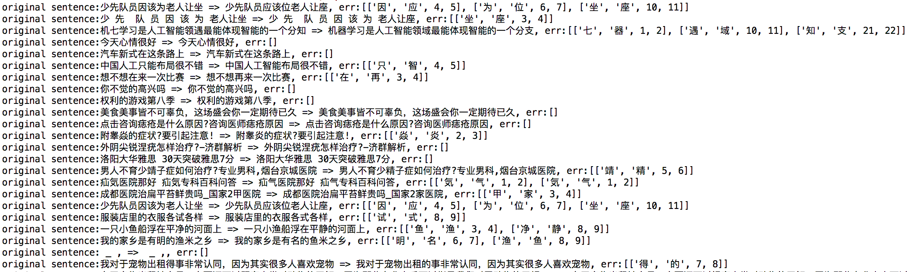
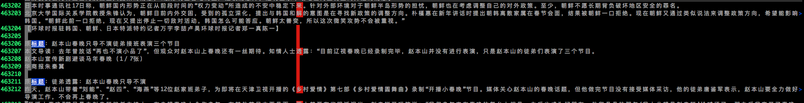

# BERT model correct error character with mask feature


### Requirements
* pip安装依赖包
```
pip install transformers==2.10.0
```

## 使用说明


1. 下载用中文文本fine-tuned3轮后的预训练BERT MLM模型（百度网盘链接: https://pan.baidu.com/s/14E7jtEgEtxWnwcggRBWeiw 提取码: dd9e；飞书链接: https://l6pmn3b1eo.feishu.cn/file/boxcnevzS1RYa1J7gLXz0Jtjwyf?from=from_qr_code   密码: KljQ），解压后放置于`data/bert_models`目录下。
```
bert_models
└── chinese_finetuned_lm
    ├── config.json
    ├── pytorch_model.bin
    └── vocab.txt
```

2. 运行`bert_corrector.py`进行纠错。
```
python3 bert_corrector.py
```

3. 评估

- run
 `python tests/bert_corrector_test.py`
- result


纠错结果还算可圈可点，速度有点慢，可以用albert-tiny之类的参数小些的模型加速预测。


### Evaluate

提供评估脚本[pycorrector/utils/eval.py](../utils/eval.py)，该脚本有两个功能：
- 构建评估样本集：自动生成评估集[pycorrector/data/eval_corpus.json](../data/eval_corpus.json), 包括字粒度错误100条、词粒度错误100条、语法错误100条，正确句子200条。用户可以修改条数生成其他评估样本分布。
- 计算纠错准召率：采用保守计算方式，简单把纠错之后与正确句子完成匹配的视为正确，否则为错。

执行该评估脚本后，

Bert模型纠错效果评估如下：
- 准确率：284/500=57.8%
- 召回率：105/300=36.7%

规则方法的纠错效果评估如下：
- 准确率：320/500=64%
- 召回率：152/300=50.67%


可以看出Bert模型对文本有强大的表达能力，仅仅依赖预训练的MLM模型，在纠错能力上就比优化良久的专家规则方法稍差而已，而且看结果细节一些纠正还挺靠谱。

看来选择一个好的模型，选择一个正确的方向真的很重要。我在这里只能希望规则的方法尽量做到扩展性好些，深度模型尽量做到调研各种模型全一些，深入一些。


## Fine-tuned BERT model with chinese corpus

### chinese corpus

- 人名日报2014版数据（网盘链接:https://pan.baidu.com/s/1971a5XLQsIpL0zL0zxuK2A  密码:uc11）101MB
- CGED三年比赛数据（本项目已经提供）2.8MB
- 部分中文维基百科数据（wiki上自行下载）50MB


### fine-tune
使用[transformers](https://github.com/huggingface/transformers)(旧称pytorch-pretrained-BERT)的[examples/language-modeling/run_language_modeling.py](https://github.com/huggingface/transformers/blob/master/examples/language-modeling/run_language_modeling.py)处理。
- fine-tune模型
```bash

export CUDA_VISIBLE_DEVICES=0,1,2
export TRAIN_FILE=people2014_cged_wiki.txt
export TEST_FILE=people2014_cged_wiki.txt


python run_language_modeling.py \
    --output_dir=chinese_finetuned_lm \
    --model_type=bert \
    --model_name_or_path=bert-base-chinese \
    --do_train \
    --train_data_file=$TRAIN_FILE \
    --do_eval \
    --eval_data_file=$TEST_FILE \
    --mlm
```
- 结果

该脚本自动从S3下载`bert-base-chinese`模型，然后fine-tune训练，完后的模型放置于`data/bert_models`目录下：
```
bert_models
└── chinese_finetuned_lm
    ├── config.json
    ├── pytorch_model.bin
    └── vocab.txt
```
使用以上方法fine-tune3轮后的中文bert模型，下载见使用说明的网盘链接。

## 附录
- 训练时长：3块p40GPU训练3轮，超过24小时。
- GPU机器配置：
```
+-----------------------------------------------------------------------------+
| NVIDIA-SMI 418.39       Driver Version: 418.39       CUDA Version: 10.1     |
|-------------------------------+----------------------+----------------------+
| GPU  Name        Persistence-M| Bus-Id        Disp.A | Volatile Uncorr. ECC |
| Fan  Temp  Perf  Pwr:Usage/Cap|         Memory-Usage | GPU-Util  Compute M. |
|===============================+======================+======================|
|   0  Tesla P40           On   | 00000000:00:0A.0 Off |                    0 |
| N/A   82C    P0   172W / 250W |  22747MiB / 22919MiB |    100%      Default |
+-------------------------------+----------------------+----------------------+
|   1  Tesla P40           On   | 00000000:00:0B.0 Off |                    0 |
| N/A   25C    P8     9W / 250W |     10MiB / 22919MiB |      0%      Default |
+-------------------------------+----------------------+----------------------+
|   2  Tesla P40           On   | 00000000:00:0C.0 Off |                    0 |
| N/A   26C    P8    10W / 250W |     10MiB / 22919MiB |      0%      Default |
+-------------------------------+----------------------+----------------------+

```
- chinese corpus数据示例

要求：人名日报数据以标题分段，即每个标题之前添加空行。（vim参考操作为  `:%s/原标题/\r原标题`）

数据截图：

