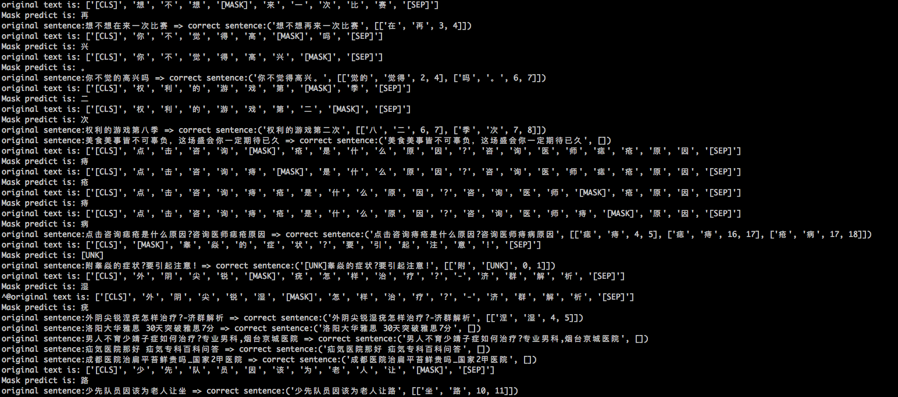

# BERT model correct error character with mask feature

## Fine-tuned BERT model with chinese corpus

### chinese corpus

- 人名日报2014版数据（网盘链接:https://pan.baidu.com/s/1971a5XLQsIpL0zL0zxuK2A  密码:uc11）101MB
- CGED三年比赛数据（本项目已经提供）2.8MB
- 部分中文维基百科数据（wiki上自行下载）50MB


### fine-tune
使用[transformers](https://github.com/huggingface/transformers/blob/master/examples/run_lm_finetuning.py)(旧称pytorch-pretrained-BERT)的[examples/run_lm_finetuning](https://github.com/huggingface/transformers/blob/master/examples/run_lm_finetuning.py)处理。
- fine-tune模型
```bash

export CUDA_VISIBLE_DEVICES=0,1,2
export TRAIN_FILE=people2014_cged_wiki.txt
export TEST_FILE=people2014_cged_wiki.txt

python run_lm_finetuning.py \
    --output_dir=chinese_finetuned_lm \
    --model_type=bert \
    --model_name_or_path=bert-base-chinese \
    --do_train \
    --train_data_file=$TRAIN_FILE \
    --do_eval \
    --eval_data_file=$TEST_FILE \
    --mlm
    --num_train_epochs=3


```
- 结果
该脚本自动从S3下载`bert-base-chinese`模型，然后fine-tune训练，完后的模型保存在`output_dir`中。

```
chinese_finetuned_lm
├── config.json
├── pytorch_model.bin
└── vocab.txt
```


PS:提供使用以上方法fine-tune3轮后的中文bert模型（网盘链接:https://pan.baidu.com/s/1QCRe5fXSinXSY1lfm7BaQg  密码:m4mg），下载解压后文件夹放置于data/bert_pytorch目录下。

## Predict Result
- run
 `python tests/bert_corrector_test.py`
- result


### 结论
部分错字可以纠正，但也会过纠，甚至有语义改写的情况。

## 附录
- 训练时长：3块p40GPU训练3轮，超过24小时。
- GPU机器配置：
```
+-----------------------------------------------------------------------------+
| NVIDIA-SMI 418.39       Driver Version: 418.39       CUDA Version: 10.1     |
|-------------------------------+----------------------+----------------------+
| GPU  Name        Persistence-M| Bus-Id        Disp.A | Volatile Uncorr. ECC |
| Fan  Temp  Perf  Pwr:Usage/Cap|         Memory-Usage | GPU-Util  Compute M. |
|===============================+======================+======================|
|   0  Tesla P40           On   | 00000000:00:0A.0 Off |                    0 |
| N/A   82C    P0   172W / 250W |  22747MiB / 22919MiB |    100%      Default |
+-------------------------------+----------------------+----------------------+
|   1  Tesla P40           On   | 00000000:00:0B.0 Off |                    0 |
| N/A   25C    P8     9W / 250W |     10MiB / 22919MiB |      0%      Default |
+-------------------------------+----------------------+----------------------+
|   2  Tesla P40           On   | 00000000:00:0C.0 Off |                    0 |
| N/A   26C    P8    10W / 250W |     10MiB / 22919MiB |      0%      Default |
+-------------------------------+----------------------+----------------------+

```
- chinese corpus数据示例

要求：人名日报数据以标题分段，即每个标题之前添加空行。（vim参考操作为  `:%s/原标题/\r原标题`）

数据截图：

