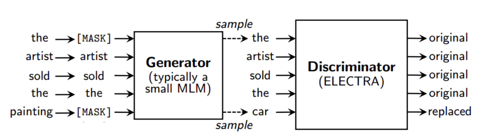

# ELECTRA Model

### Requirements
* pip安装依赖包
```
pip install tokenizers==0.9.4 torch>=1.3.1
```

## 使用说明


1. 下载`ELECTRA-base, Chinese` Pytorch模型，解压后放置于`data/electra_models`目录并解压缩即可下。
```
electra_models
└── chinese_electra_base_generator_pytorch
	├── config.json
	├── pytorch_model.bin
	└── vocab.txt
```

2. 运行`electra_corrector.py`进行纠错。
```
python3 electra_corrector.py
```

3. 评估

todo


## 简介
**ELECTRA**提出了一套新的预训练框架，其中包括两个部分：**Generator**和**Discriminator**。
- **Generator**: 一个小的MLM，在[MASK]的位置预测原来的词。Generator将用来把输入文本做部分词的替换。
- **Discriminator**: 判断输入句子中的每个词是否被替换，即使用Replaced Token Detection (RTD)预训练任务，取代了BERT原始的Masked Language Model (MLM)。需要注意的是这里并没有使用Next Sentence Prediction (NSP)任务。


为了进一步促进中文预训练模型技术的研究与发展，哈工大讯飞联合实验室基于官方ELECTRA训练代码以及大规模的中文数据训练出中文ELECTRA预训练模型供大家下载使用。
其中ELECTRA-small模型可与BERT-base甚至其他同等规模的模型相媲美，而参数量仅为BERT-base的1/10。

更详细的内容请查阅ELECTRA论文：[ELECTRA: Pre-training Text Encoders as Discriminators Rather Than Generators](https://openreview.net/pdf?id=r1xMH1BtvB)

## 模型下载
本目录中包含以下模型，目前提供PyTorch和TensorFlow版本权重。

* **`ELECTRA-base, Chinese`**：12-layer, 768-hidden, 12-heads, 102M parameters
* **`ELECTRA-small, Chinese`**: 12-layer, 256-hidden, 4-heads, 12M parameters


| 模型简称 | 语料 | Google下载 | 压缩包大小 |
| :------- | :--------- | :---------: | :---------: |
| **`ELECTRA-base, Chinese`** | 中文维基+通用数据 | [TensorFlow](https://drive.google.com/open?id=1FMwrs2weFST-iAuZH3umMa6YZVeIP8wD) <br/> [PyTorch-D](https://drive.google.com/open?id=1iBanmudRHLm3b4X4kL_FxccurDjL4RYe) <br/> [PyTorch-G](https://drive.google.com/open?id=1x-fcgS9GU8X51H1FFiqkh0RIDMGTTX7c) | 383M |
| **`ELECTRA-small, Chinese`** | 中文维基+通用数据 | [TensorFlow](https://drive.google.com/open?id=1uab-9T1kR9HgD2NB0Kz1JB_TdSKgJIds) <br/> [PyTorch-D](https://drive.google.com/open?id=1A1wdw41kOFC3n3AjfFTRZHQdjCL84bsg) <br/> [PyTorch-G](https://drive.google.com/open?id=1FpdHG2UowDTIepiuOiJOChrtwJSMQJ6N) | 46M |

* PyTorch-D: discriminator, PyTorch-G: generator

以PyTorch版`ELECTRA-base, Chinese`为例，下载完毕后对zip文件进行解压得到：
```
chinese_electra_base_discriminator_pytorch
├── config.json                # 模型配置文件
├── pytorch_model.bin          # 模型权重文件
└── vocab.txt                  # 词表

chinese_electra_base_generator_pytorch
├── config.json
├── pytorch_model.bin
└── vocab.txt
```

### 训练细节
我们采用了大规模中文维基以及通用文本训练了ELECTRA模型，总token数达到5.4B，与[RoBERTa-wwm-ext系列模型](https://github.com/ymcui/Chinese-BERT-wwm)一致。词表方面沿用了谷歌原版BERT的WordPiece词表，包含21128个token。其他细节和超参数如下（未提及的参数保持默认）：
- `ELECTRA-base`: 12层，隐层768，12个注意力头，学习率2e-4，batch256，最大长度512，训练1M步
- `ELECTRA-small`: 12层，隐层256，4个注意力头，学习率5e-4，batch1024，最大长度512，训练1M步


## 快速加载

本项目迁移了[Huggingface-Transformers 4.2.0dev0](https://github.com/huggingface/transformers)到`pycorrector/transformers`，更新了兼容代码，可支持ELECTRA模型，可通过如下命令调用。

example: [predict_mask.py](predict_mask.py)

```python
from pycorrector.transformers import pipeline, ElectraForPreTraining, ElectraTokenizer
pwd_path = os.path.abspath(os.path.dirname(__file__))

D_model_dir = os.path.join(pwd_path, "../data/electra_models/chinese_electra_base_discriminator_pytorch/")
tokenizer = ElectraTokenizer.from_pretrained(D_model_dir)
discriminator = ElectraForPreTraining.from_pretrained(D_model_dir)

```


## Feature

1. 虽然像BERT这样的MASK语言建模(MLM)预训练方法在下游的NLP任务上产生了很好的结果，但是它们需要大量的计算才能有效。
这些方法通过用[MASK]替换一些Token来破坏输入，然后训练一个模型来重构Token。

2. 作为一种替代方案，我们提出了一种更具效率的预训练，称为Replaced token detection(RTD)判断当前词是否被替换了。
我们的方法不是屏蔽输入，而是用从小型GAN中提取的plausible alternatives sampled替换一些输入Token，从而破坏输入。然后，我们不是训练一个模型来预测[MASK]，
而是训练一个判别模型来[MASK]输入中的每个Token是否被生成器样本替换。实验表明，这种预训练模型更有效，因为它从所有的输入中学习，而不是仅仅从[MASK]中。

3. 在相同的模型大小、数据和计算条件下，通过我们的方法学习的上下文表示大大优于通过BERT和XLNet等方法学习的上下文表示。

<p align="center">
    <br>
    
    <br>
</p>

- GAN的引入

本文一个突出贡献就是将GAN引入到预训练语言模型中，并且取得了SOTA（state of the art）的效果。

- Generator 生成器

通过对MASK后的句子生成样本，这里使用的是MLM（maximum likelihood），而不是Adversarially。

- Discriminator 判别器

通过序列标注的方法，判断当前词是否是原文（original，replaced），GAN生成的都是假的，但是本文的G会生成真实样本（部分词汇真实），梯度不能从D传到G，所以使用强化学习的方法来训练G。

- 权重共享

正常情况下，Generator和Discriminator使用相同的大小，但实验表明，Generator更小效果会好点。

Generator和Discriminator只是对于token embeddings进行共享，如果将所有权重共享效果反而会差点。

- Smaller Generators

实验表明，Generator的大小为Discriminator的1/4~1/2效果最好，作者提出，Generator太大会给Discriminator造成困扰。

- Training Algorithms

将Generator和Discriminator进行联合训练，开始只训练通过MLM去训练Generator，然后用Generator的参数去初始化Discriminator，训练Discriminator同时冻结 Generator的参数。

- Contrastive Learning

通过对比学习方法来区分虚构的负样本与正样本。

## References
* [Chinese-ELECTRA](https://github.com/ymcui/Chinese-ELECTRA)
* [transformers](https://github.com/huggingface/transformers)