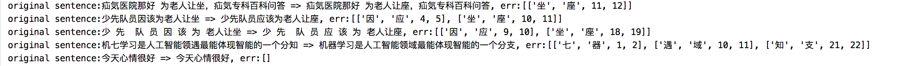

# ERNIE model correct text error with mask feature


### Requirements
* pip安装依赖包
```
pip install paddlepaddle==1.8.4 # pip install paddlepaddle-gpu
```

## 使用说明


1. 运行`ernie_corrector.py`进行纠错。
```
python3 ernie_corrector.py
```
- result


2. 评估

- run
```python
from pycorrector.utils.eval import eval_bert_with_sighan_2015
eval_bert_with_sighan_2015()
```
example:

 `python examples/evaluate_models.py`


纠错结果还算可圈可点，支持词粒度文本纠错，支持长文本语义纠错，可以用GPU加速预测。


### Evaluate

提供评估脚本[pycorrector/utils/eval.py](../utils/eval.py)，该脚本有两个功能：
- 构建评估样本集：自动生成评估集[pycorrector/data/eval_corpus.json](../data/eval_corpus.json), 包括字粒度错误100条、词粒度错误100条、语法错误100条，正确句子200条。用户可以修改条数生成其他评估样本分布。
- 计算纠错准召率：采用保守计算方式，简单把纠错之后与正确句子完成匹配的视为正确，否则为错。

执行该评估脚本后，

ERNIE模型纠错效果评估如下：
- 准确率：/500=%
- 召回率：/300=%


可以看出ERNIE模型对文本有强大的表达能力，仅仅依赖预训练的MLM模型，在纠错能力上就比优化良久的专家规则方法稍差而已，而且看结果细节一些纠正还挺靠谱。

看来选择一个好的模型，选择一个正确的方向真的很重要。我在这里只能希望规则的方法尽量做到扩展性好些，深度模型尽量做到调研各种模型全一些，深入一些。


## Fine-tuned ERNIE model with chinese corpus

### chinese corpus

- 人名日报2014版数据（网盘链接:https://pan.baidu.com/s/1971a5XLQsIpL0zL0zxuK2A  密码:uc11）101MB
- CGED三年比赛数据（本项目已经提供）2.8MB
- 部分中文维基百科数据（wiki上自行下载）50MB


