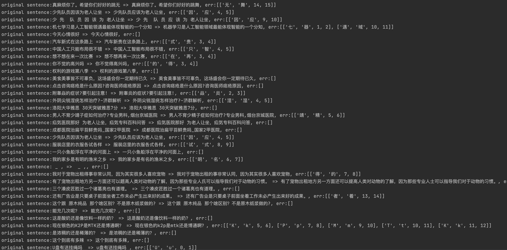

# MacBertMaskedLM For Correction

## 使用说明

### 快速加载

本项目是MacBERT改变网络结构的中文文本纠错模型，可支持BERT类模型为backbone。模型网络结构，参考softmaskedbert：


可通过如下命令调用：

example: [correct_demo.py](correct_demo.py)

```python
from pycorrector.macbert.macbert_corrector import MacBertCorrector

nlp = MacBertCorrector("shibing624/macbert4csc-base-chinese").macbert_correct

i = nlp('今天新情很好')
print(i)
```

当然，你也可使用官方的transformers库进行调用。

1.先pip安装transformers库：

```shell
pip install transformers>=4.1.1
```
2.使用以下示例执行：

```python
import operator
import torch
from transformers import BertTokenizer, BertForMaskedLM
device = torch.device("cuda" if torch.cuda.is_available() else "cpu")

tokenizer = BertTokenizer.from_pretrained("shibing624/macbert4csc-base-chinese")
model = BertForMaskedLM.from_pretrained("shibing624/macbert4csc-base-chinese")
model = model.to(device)

texts = ["今天新情很好", "你找到你最喜欢的工作，我也很高心。"]
with torch.no_grad():
    outputs = model(**tokenizer(texts, padding=True, return_tensors='pt').to(device))

def get_errors(corrected_text, origin_text):
    sub_details = []
    for i, ori_char in enumerate(origin_text):
        if ori_char in [' ', '“', '”', '‘', '’', '琊', '\n', '…', '—', '擤']:
            # add unk word
            corrected_text = corrected_text[:i] + ori_char + corrected_text[i:]
            continue
        if i >= len(corrected_text):
            continue
        if ori_char != corrected_text[i]:
            if ori_char.lower() == corrected_text[i]:
                # pass english upper char
                corrected_text = corrected_text[:i] + ori_char + corrected_text[i + 1:]
                continue
            sub_details.append((ori_char, corrected_text[i], i, i + 1))
    sub_details = sorted(sub_details, key=operator.itemgetter(2))
    return corrected_text, sub_details

result = []
for ids, text in zip(outputs.logits, texts):
    _text = tokenizer.decode(torch.argmax(ids, dim=-1), skip_special_tokens=True).replace(' ', '')
    corrected_text = _text[:len(text)]
    corrected_text, details = get_errors(corrected_text, text)
    print(text, ' => ', corrected_text, details)
    result.append((corrected_text, details))
print(result)
```

output:
```shell
今天新情很好  =>  今天心情很好 [('新', '心', 2, 3)]
你找到你最喜欢的工作，我也很高心。  =>  你找到你最喜欢的工作，我也很高兴。 [('心', '兴', 15, 16)]
```

模型文件组成：
```
macbert4csc-base-chinese
    ├── config.json
    ├── added_tokens.json
    ├── pytorch_model.bin
    ├── special_tokens_map.json
    ├── tokenizer_config.json
    └── vocab.txt
```

### Evaluate

提供评估脚本[pycorrector/utils/eval.py](../utils/eval.py)，该脚本有两个功能：

- 构建评估样本集：评估集[pycorrector/data/eval_corpus.json](../data/eval_corpus.json),
  包括字粒度错误100条、词粒度错误100条、语法错误100条，正确句子200条。用户可以修改条数生成其他评估样本分布。
- 计算纠错准召率：采用保守计算方式，简单把纠错之后与正确句子完成匹配的视为正确，否则为错。

执行该评估脚本后，

`shibing624/macbert4csc-base-chinese` 模型在corpus500纠错效果评估如下：

- Sentence Level: acc:0.656000, precision:0.779736, recall:0.591973, f1:0.673004

规则方法(加入自定义混淆集)在corpus500纠错效果评估如下：

- Sentence Level: acc:0.64, recall:0.5067

`shibing624/macbert4csc-base-chinese` 在 SIGHAN2015 测试集纠错效果评估如下：

- Char Level: precision=0.9372, recall=0.8640, f1=0.8991
- Sentence Level: precision:0.8264, recall:0.7366, f1:0.7789

由于训练使用的数据使用了SIGHAN2015的训练集（复现paper），在SIGHAN2015的测试集上达到SOTA水平。

#### 评估case

- run
  `python tests/macbert_corrector_test.py`
- result
  

纠错结果除部分英文大小写问题外，在sighan15上达到了SOTA水平。


## 训练

### 安装依赖
```shell
pip install transformers>=4.1.1 pytorch-lightning>=1.1.2 torch>=1.7.0 
```
### 训练数据集

#### toy数据集（约1千条）
```shell
cd macbert
python preprocess.py
```
得到toy数据集文件：
```shell
macbert/output
|-- dev.json
|-- test.json
`-- train.json
```
#### SIGHAN+Wang271K中文纠错数据集


| 数据集 | 语料 | 下载链接 | 压缩包大小 |
| :------- | :--------- | :---------: | :---------: |
| **`SIGHAN+Wang271K中文纠错数据集`** | SIGHAN+Wang271K(27万条) | [百度网盘（密码01b9）](https://pan.baidu.com/s/1BV5tr9eONZCI0wERFvr0gQ)| 106M |
| **`原始SIGHAN数据集`** | SIGHAN13 14 15 | [官方csc.html](http://nlp.ee.ncu.edu.tw/resource/csc.html)| 339K |
| **`原始Wang271K数据集`** | Wang271K | [Automatic-Corpus-Generation dimmywang提供](https://github.com/wdimmy/Automatic-Corpus-Generation/blob/master/corpus/train.sgml)| 93M |


SIGHAN+Wang271K中文纠错数据集，数据格式：
```json
[
    {
        "id": "B2-4029-3",
        "original_text": "晚间会听到嗓音，白天的时候大家都不会太在意，但是在睡觉的时候这嗓音成为大家的恶梦。",
        "wrong_ids": [
            5,
            31
        ],
        "correct_text": "晚间会听到噪音，白天的时候大家都不会太在意，但是在睡觉的时候这噪音成为大家的恶梦。"
    }
]
```

下载`SIGHAN+Wang271K中文纠错数据集`，下载后新建output文件夹并放里面，文件位置同上。

#### 自有数据集

把自己数据集标注好，保存为跟训练样本集一样的json格式，然后加载模型继续训练即可。

1. 已有大量业务相关错误样本，主要标注错误位置（wrong_ids）和纠错后的句子(correct_text)
2. 没有现成的错误样本，可以手动写脚本生成错误样本（original_text），根据音似、形似等特征把正确句子的指定位置（wrong_ids）字符改为错字

### 训练MacBert4CSC
```shell
python train.py
```
### 预测
- 方法一：直接加载保存的ckpt文件：
```shell
python infer.py
```

- 方法二：加载`pytorch_model.bin`文件：
把`output/macbert4csc`文件夹下以下模型文件复制到`~/.pycorrector/dataset/macbert_models/chinese_finetuned_correction`目录下，
就可以像上面`快速加载`使用pycorrector或者transformers调用。

```shell
output
└── macbert4csc
    ├── config.json
    ├── pytorch_model.bin
    ├── special_tokens_map.json
    ├── tokenizer_config.json
    └── vocab.txt
```

demo示例[macbert_corrector.py](macbert_corrector.py):
```
python3 macbert_corrector.py
```

### 训练SoftMaskedBert4CSC
```shell
python train.py --config_file train_softmaskedbert4csc.yml
```

# Reference
- [https://github.com/gitabtion/BertBasedCorrectionModels](https://github.com/gitabtion/BertBasedCorrectionModels)

