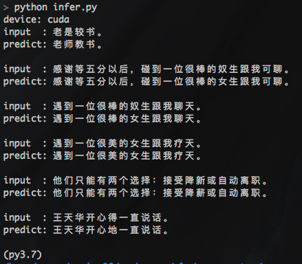

# Seq2seq Attention Model


## Features

* 基于Attention机制的Sequence to Sequence模型
* Luong Attention
* Conv Seq2Seq model, GPU并行计算，训练加速
* 训练加速tricks：dataset bucketing, prefetching, token-based batching, gradients accumulation
* Beam Search
* Chinese Samples: sighan2015 sample data, CGED sample data

## Usage

### Requirements
* pip安装依赖包
```
torch>=1.4.0
transformers>=4.4.2
tensorboardX
```

## Demo

- convseq2seq demo

示例[seq2seq_demo.py](../../examples/seq2seq_demo.py)
```
cd ../../examples
python seq2seq_demo.py --do_train --do_predict
```

## Detail


### Train
data example:
```
# train.txt:
你说的是对，跟那些失业的人比起来你也算是辛运的。	你说的是对，跟那些失业的人比起来你也算是幸运的。
```
run train.py
```
python train.py
```

### Infer
```
python infer.py

```


### Result
```
input  : 老是较书。
predict: 老师教书。

input  : 感谢等五分以后，碰到一位很棒的奴生跟我可聊。
predict: 感谢等五分以后，碰到一位很棒的女生跟我可聊。

input  : 遇到一位很棒的奴生跟我聊天。
predict: 遇到一位很棒的女生跟我聊天。

input  : 遇到一位很美的女生跟我疗天。
predict: 遇到一位很美的女生跟我疗天。

input  : 他们只能有两个选择：接受降新或自动离职。
predict: 他们只能有两个选择：接受降薪或自动离职。

input  : 王天华开心得一直说话。
predict: 王天华开心地一直说话。

```



### big train data

download from https://pan.baidu.com/s/1BkDru60nQXaDVLRSr7ktfA  密码:m6fg [130W sentence pair，215MB], put data to `seq2seq/output` folder.

### release models

基于SIGHAN2015数据集训练的seq2seq和convseq2seq模型，已经release到github，下载地址：[github models](https://github.com/shibing624/pycorrector/releases/download/0.4.5/output.tar)。

位置同以上训练脚本，放到seq2seq文件夹下即可。